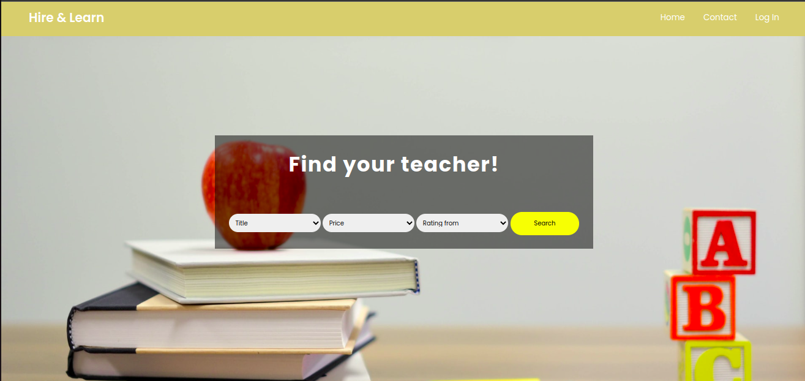
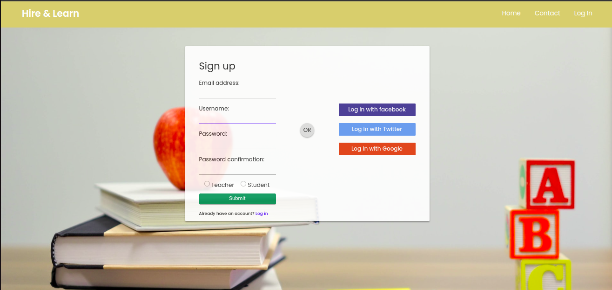
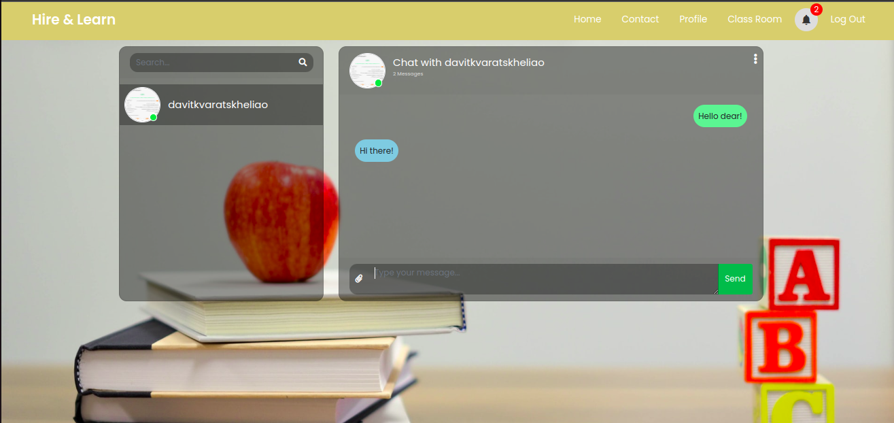

<!--
Hey, thanks for using the awesome-readme-template template.  
If you have any enhancements, then fork this project and create a pull request 
or just open an issue with the label "enhancement".

Don't forget to give this project a star for additional support ;)
Maybe you can mention me or this repo in the acknowledgements too
-->
<div align="center">

  
  <h1>Awesome Readme Template</h1>
  
  <p>
    Hire & Learn
  </p>
  
  
<!-- Badges -->
<p>
  <a href="https://github.com/davitkv8/Hire-Learn/graphs/contributors">
    
  </a>
  <a href="">
    
  </a>
  <a href="https://github.com/davitkv8/Hire-Learn/network/members">
    
  </a>
  <a href="https://github.com/davitkv8/Hire-Learn/stargazers">
    
  </a>
  <a href="https://github.com/davitkv8/Hire-Learn/issues/">
    
  </a>
</p>
   
<h4>
    <a href="https://hirelearn.edu.space">View Demo</a>
  <span> · </span>
    <a href="https://github.com/davitkv8/Hire-Learn/issues/">Report Bug</a>
  <span> · </span>
    <a href="https://github.com/davitkv8/Hire-Learn/issues/">Request Feature</a>
  </h4>
</div>

<br />

<!-- Table of Contents -->
# :notebook_with_decorative_cover: Table of Contents

- [About the Project](#star2-about-the-project)
  * [Screenshots](#camera-screenshots)
  * [Tech Stack](#space_invader-tech-stack)
  * [Environment Variables](#key-environment-variables)
- [Getting Started](#toolbox-getting-started)
  * [Prerequisites](#bangbang-prerequisites)
  * [Run Locally](#running-run-locally)
  * [Deployment](#triangular_flag_on_post-deployment)
- [Roadmap](#compass-roadmap)

  

<!-- About the Project -->
## :star2: About the Project


<!-- Screenshots -->
### :camera: Screenshots

<div align="center"> 
  
  
  
</div>


<!-- TechStack -->
### :space_invader: Tech Stack

<details>
<summary>Database</summary>
  <ul>
    <li><a href="https://www.postgresql.org/">PostgreSQL</a></li>
    <li><a href="https://redis.io/">Redis</a></li>
    <li><a href="https://www.mongodb.com/">MongoDB</a></li>
  </ul>
</details>

<details>
<summary>DevOps</summary>
  <ul>
    <li><a href="https://www.docker.com/">Docker</a></li>
  </ul>
</details>


<!-- Env Variables -->
### :key: Environment Variables

To run this project, you will need to add the following environment variables to your Dockerfiles/envs/.env* file
Also, do not forget to provide your own E-mail credentials for Oauth2 integration functionalities

<!-- Getting Started -->
## 	:toolbox: Getting Started

<!-- Prerequisites -->
### :bangbang: Prerequisites

The project is dockerized and start process is fully automated.
Install docker and docker-compose first

<ul>
<li>
<a 
href="https://www.digitalocean.com/community/tutorials/how-to-install-and-use-docker-compose-on-ubuntu-22-04">How To Install Docker on Ubuntu Machine
</a>
</li>
</ul>


<!-- Run Locally -->
### :running: Run Locally

Clone the project

```bash
  git clone https://github.com/davitkv8/Hire-Learn.git --config core.autocrlf=false
```

Go to the project directory

```bash
  cd Hire-Learn
```

Run docker-compose (Usually, it will take around 3 minutes for your first run)

```bash
  docker-compose up --build
```

Visit - http://localhost:8000


<!-- Deployment -->
### :triangular_flag_on_post: Deployment

at the time, the project is available on development mode only


<!-- Roadmap -->
## :compass: Roadmap

- Add Rabbit as messaging broker to send E-mail for newly registered users.
- Restore JWT2 Authentication with Google
- Make Pivottable more usable and informative 
- Add new app - FreeResources which syncs all tech newses/resources From Georgian market
- Where possible, optimize queries to make retrievals fast
- Add celery for sync processes
- Integrate test payment APIs (BOG/TBC)
- Make naming files more efficient for usage
- Integrate ASG Interface in the whole project, to be notified anywhere if someone messages you.
- Deploy project on Linode.


<!-- Contributing -->
## :wave: Contributing

<a href="https://github.com/davitkv8/Hire-Learn/graphs/contributors">
  
</a>


Contributions are always welcome!

<!-- Contact -->
## :handshake: Contact

Davit Kvaratskhelia - [@Linkedin](https://www.linkedin.com/in/davit-kvaratskhelia/) - davit.kv8@gmail.com

